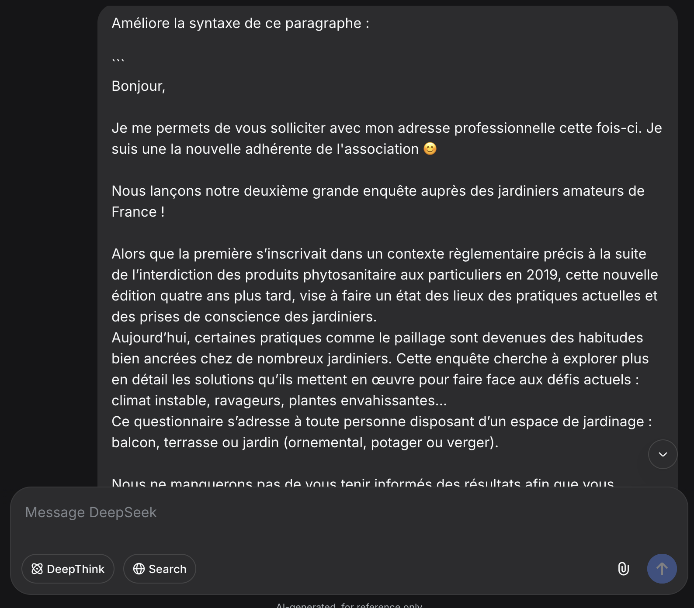
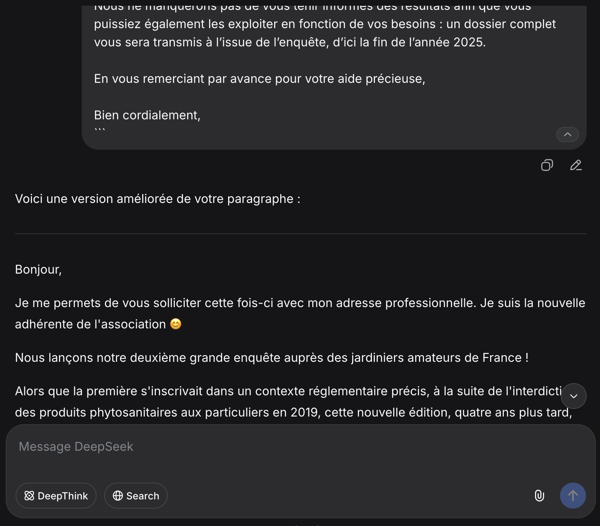
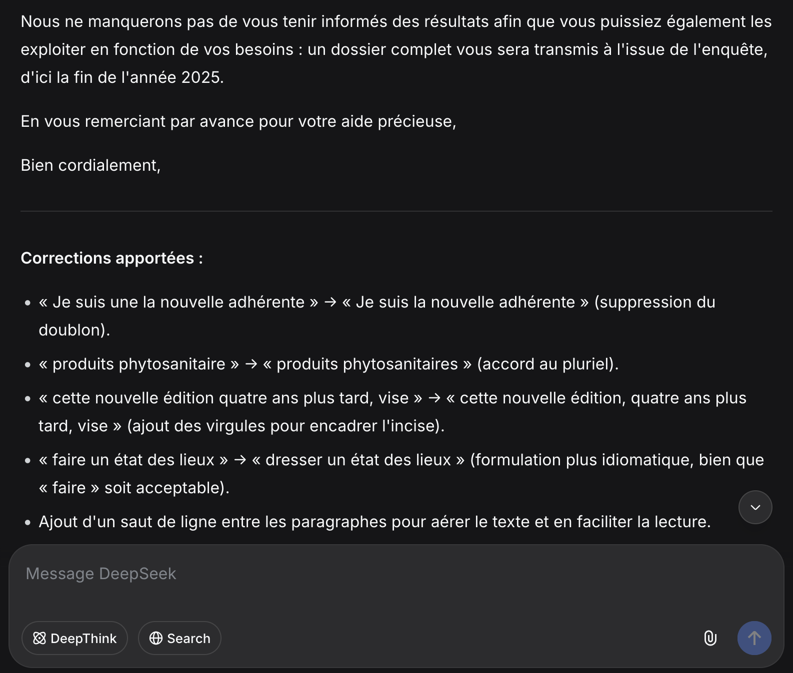
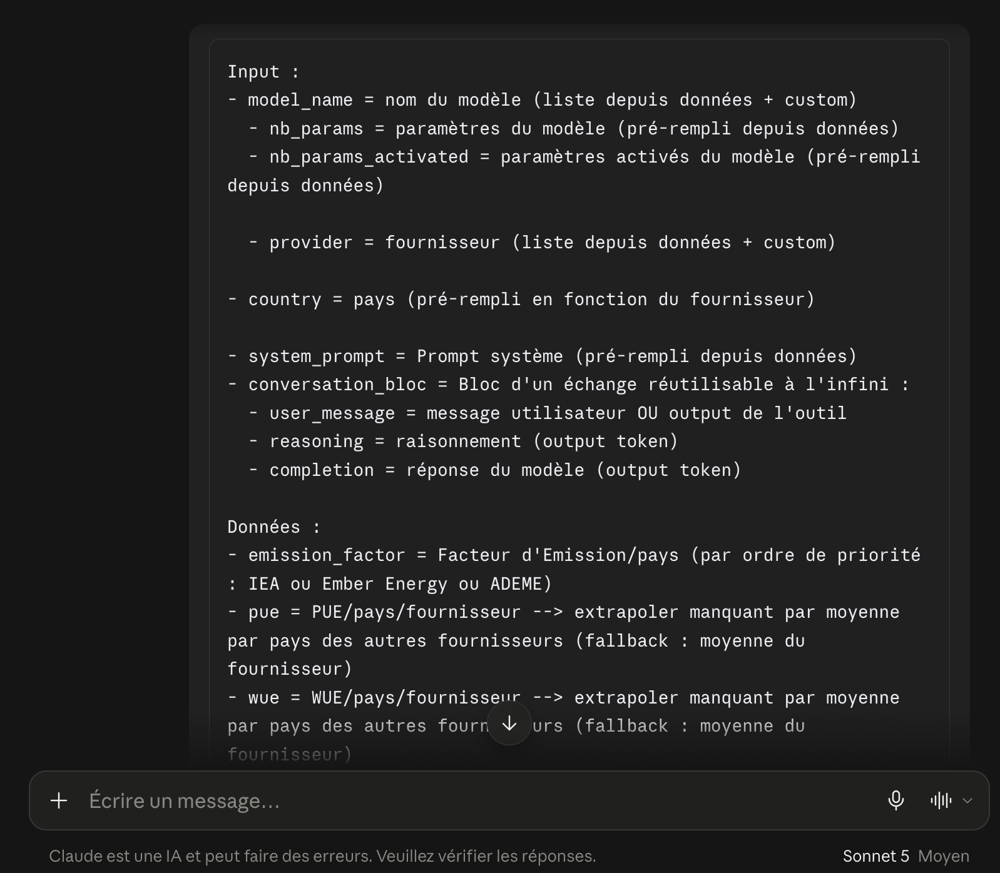
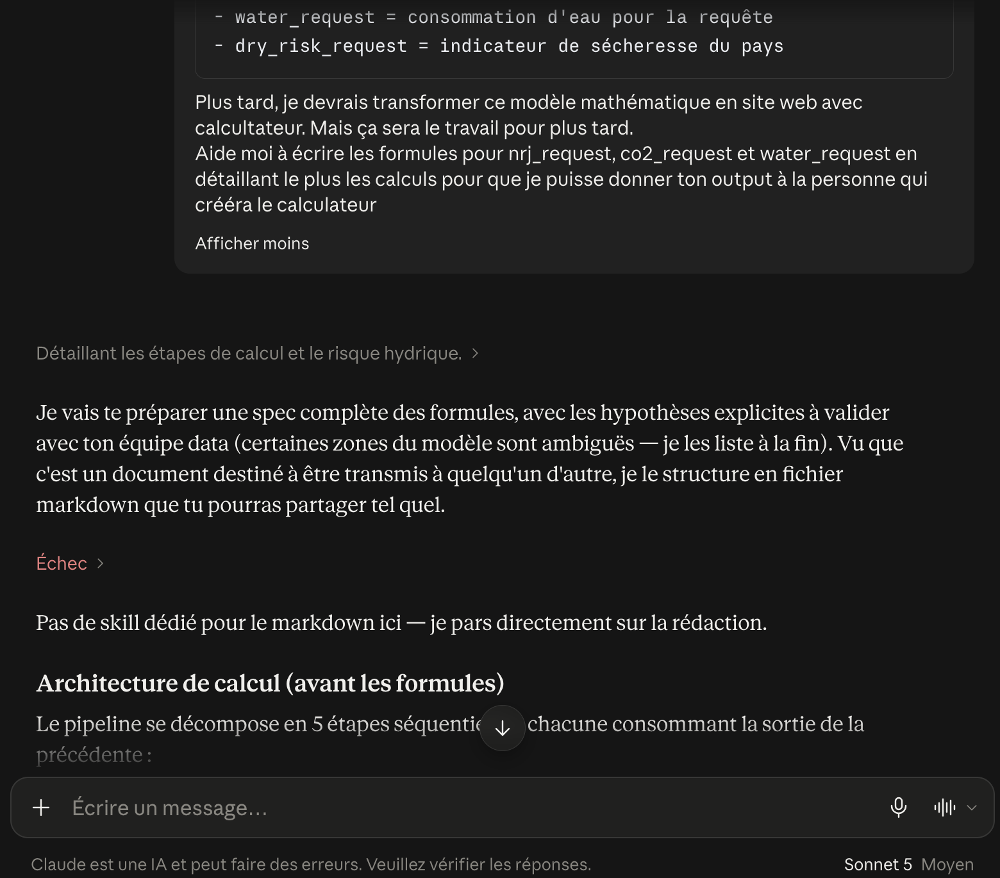
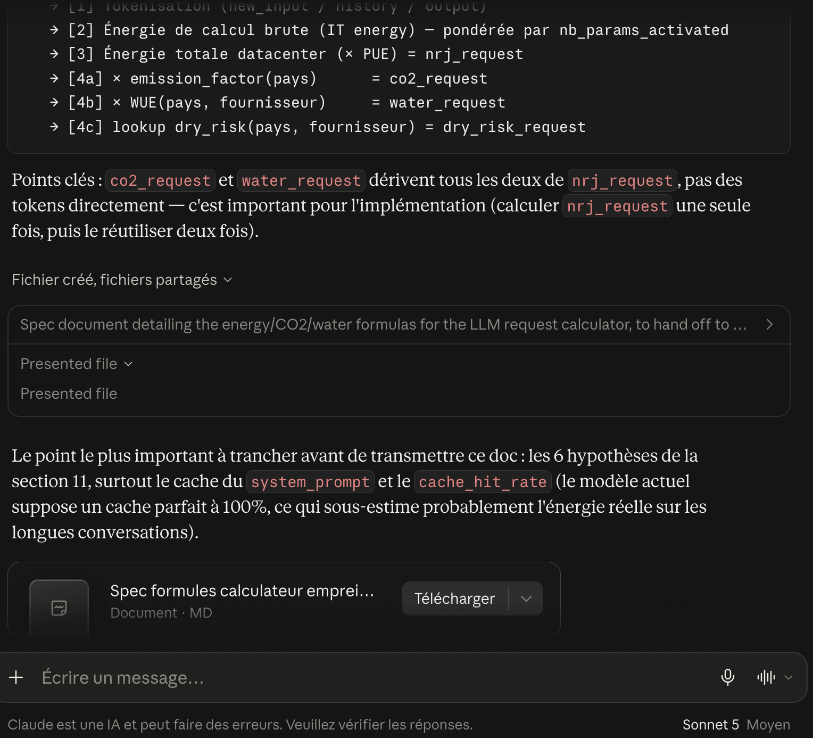

# L'impact environnemental de l'IA générative : comment le réduire peut vous faire gagner en efficacité ?

On entend souvent qu’une requête ChatGPT consomme 2,9 Wh d’électricité, soit six fois plus qu’une recherche Google, et qu’il faut environ un demi-litre d’eau pour générer 10 à 50 réponses [@enault2025impactIA].

Mais ces chiffres reflètent-ils vraiment la réalité ?

**Pas si vite !** Derrière ces affirmations se cachent des approximations et des raccourcis méthodologiques qui méritent d’être examinés de plus près.

D’après mes calculs, ce simple message envoyé à DeepSeek a émis 0,28 gCO₂e et consommé 0,06 mL d’eau.

{width=80%}
{width=80%}
{width=80%}

Pourtant, ce message bien plus complexe envoyé à Claude a, lui, émis 3,23 g de CO₂e et consommé 0,8 mL d’eau.

{width=80%}
{width=80%}
{width=80%}

**Comment expliquer une telle différence ?**

L’impact environnemental d’une interaction avec une IA dépend de nombreux paramètres. Plusieurs facteurs entrent en jeu.

Dans cet article, nous allons décrypter ce qui se cache derrière ces chiffres et comprendre ce qui fait réellement varier l’empreinte environnementale de nos échanges avec l’IA.

<!-- Sections incluses (anciennement subfile) -->
[sections/intro](sections/intro.md)

[sections/understand](sections/understand.md)

[sections/measure](sections/measure.md)
<!-- Développer les outils (calculateur) et méthodes (bibliothèques de suivi, compteur tokens observateur) pour calculer son empreinte carbone -->

[sections/reduce](sections/reduce.md)
<!-- Fouiller les formations openAI anthropic google etc pour trouver des techniques permettant de réduire l'impact environnemental. -->

[sections/conclusion](sections/conclusion.md)

<!-- Bibliographie : references.bib -->
